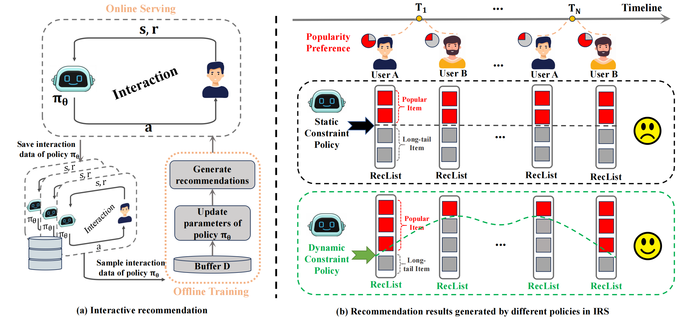

Code for  Paper[**“Beyond Trade-offs: Leveraging Spatiotemporal Heterogeneity of User Preference for Long-term Fairness and Accuracy in Interactive Recommendation”**]




## Installation

```bash
torch==1.12.0
numpy==1.23.5
pandas==1.5.3
tqdm==4.67.1
```

## Examples to run the code

- #### KuaiRand

Train user mode:

```
bash train_multi_behavior_user_response.sh
```

Then train agent model:

```
bash train_hppo_discrete
```

## Credit

This repo is based on [KuaiSim]
